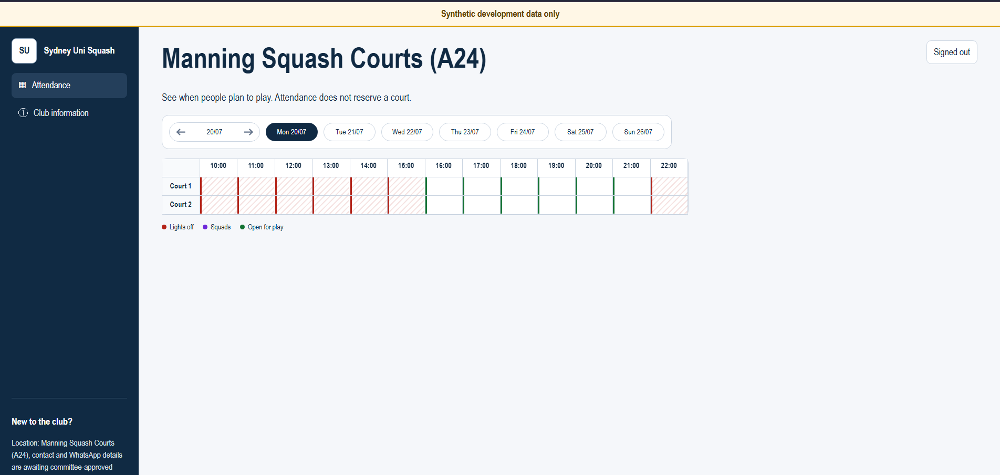

# Sydney University Squash Club Attendance Tracker

A venue-wide turnout forecast for the Sydney University Squash Club. Members announce when they plan to attend; the application does not reserve either court.

## Proposed stack

- Go
- `net/http`
- HTMX
- Server-rendered HTML templates
- SQLite
- Plain CSS
- A single deployable container with durable storage in production

## Status

Product discovery, interface design, and engineering planning are approved. Synthetic-data implementation is in progress; public identity capabilities and a real-data pilot remain committee-gated.



## Local development

The development service is deliberately synthetic-only and binds to loopback. The Makefile uses the checksum-verified user-local Go toolchain, so run it with:

```sh
make run
```

Then open `http://127.0.0.1:18080`. The service creates a disposable database under `data/`, loads obvious synthetic timetable fixtures, and never registers member identity routes in the current milestone.

For development with automatic backend restarts, run:

```sh
make dev
```

The development watcher restarts the loopback-only synthetic Go service after
changes to Go, HTML, CSS, SQL, JSON, or YAML source files. Refresh the browser
after the restart to request the rebuilt page.

Run all generation, tests, race checks, vetting, and the 80% project-owned coverage gate with:

```sh
make check
```

Pinned local tools: Go 1.26.4, `sqlc` 1.31.1, `goose` 3.27.1, and `jq` 1.8.1.
